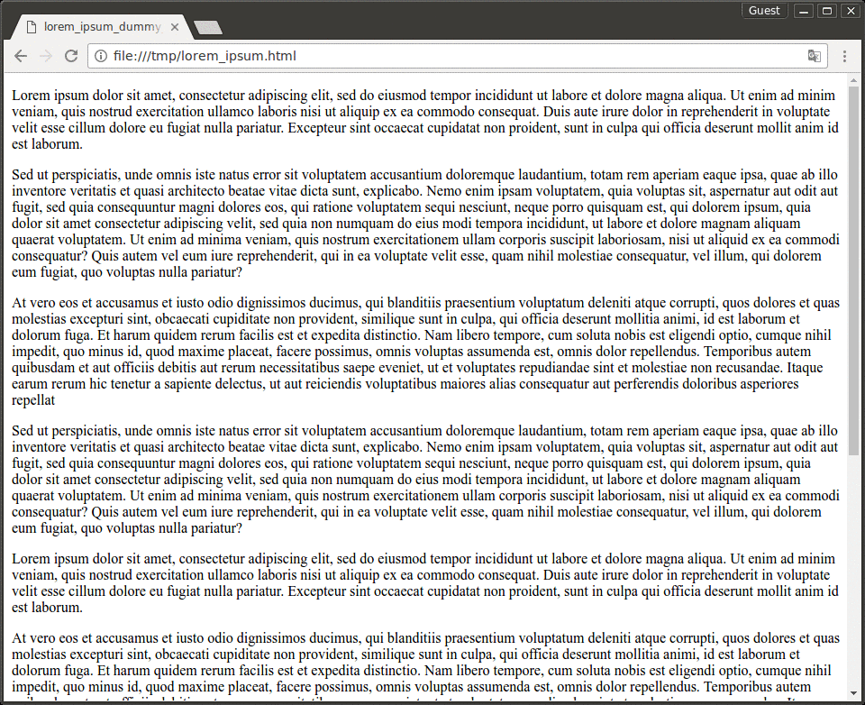
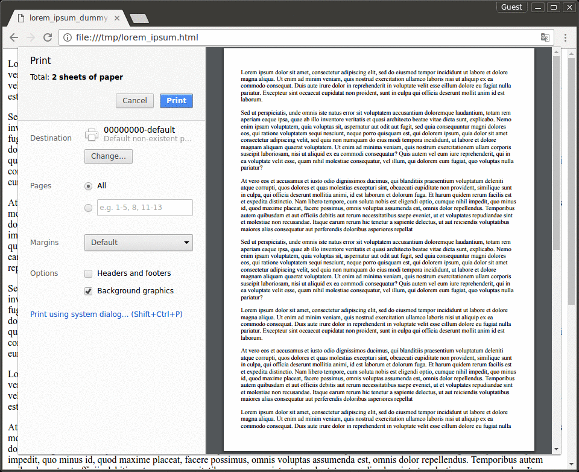
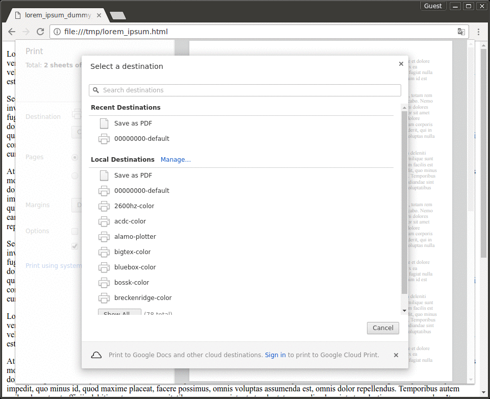
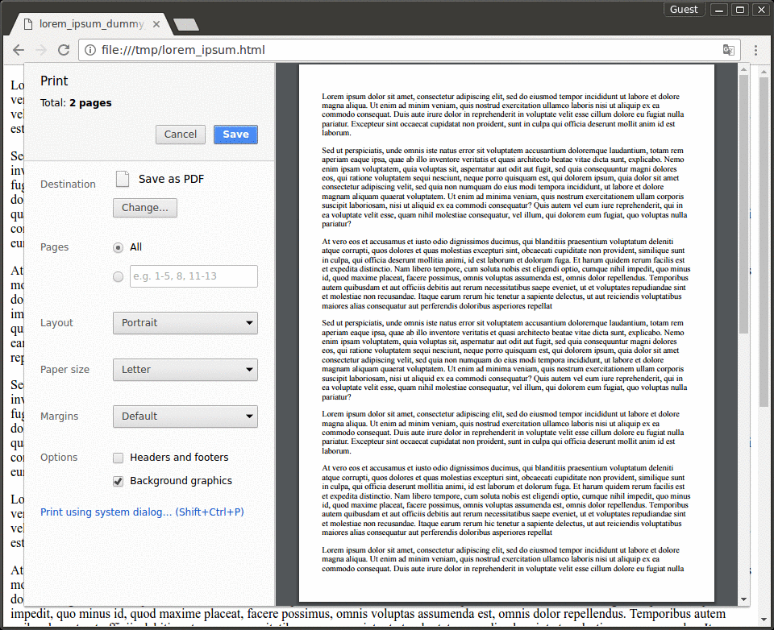
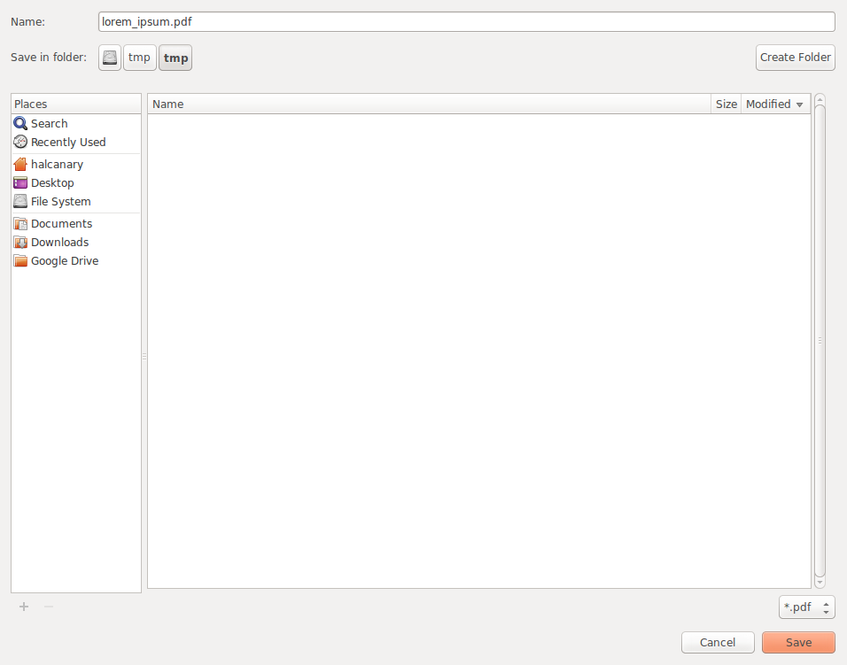

How to “Save As PDF” in Chrome
==============================

This is not exactly the same as “printing to PDF”, and often produces better results.

First: go to the menu (three dots in the top right corner) and select “Print...”

Next: click on “Change...” to change your destination.

Next: select “Save as PDF” as your destination.

Now the destination is set to “Save as PDF”.  Click the “Save” button.

Choose a file name and directory and click “Save” again.

